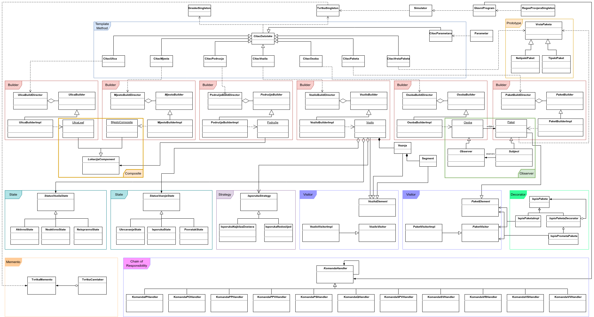
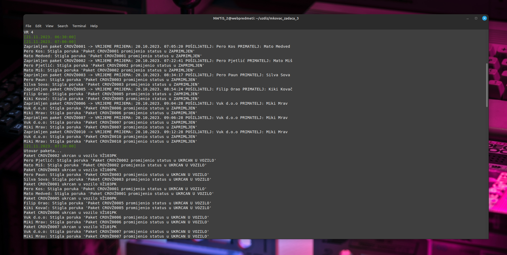
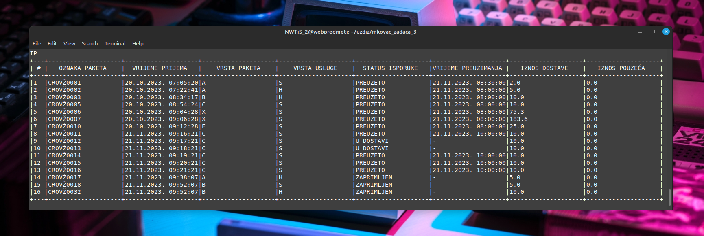
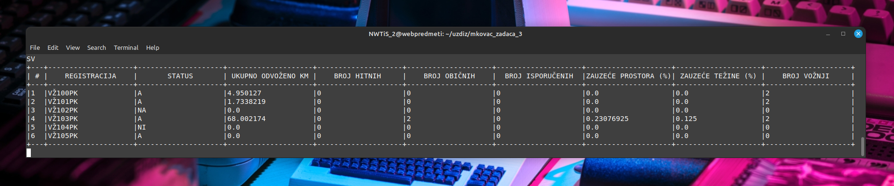
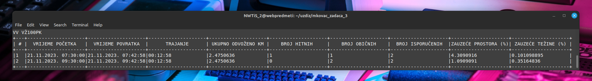
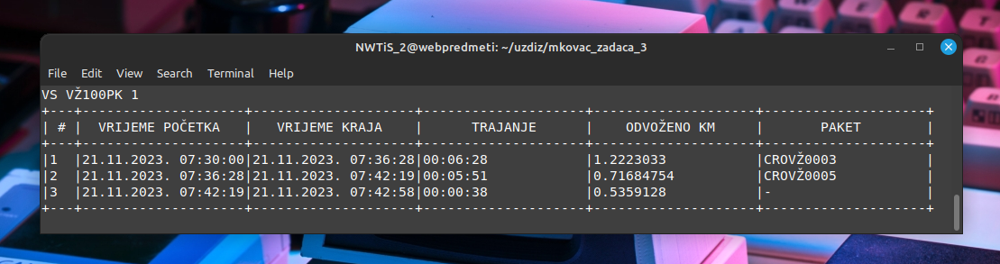
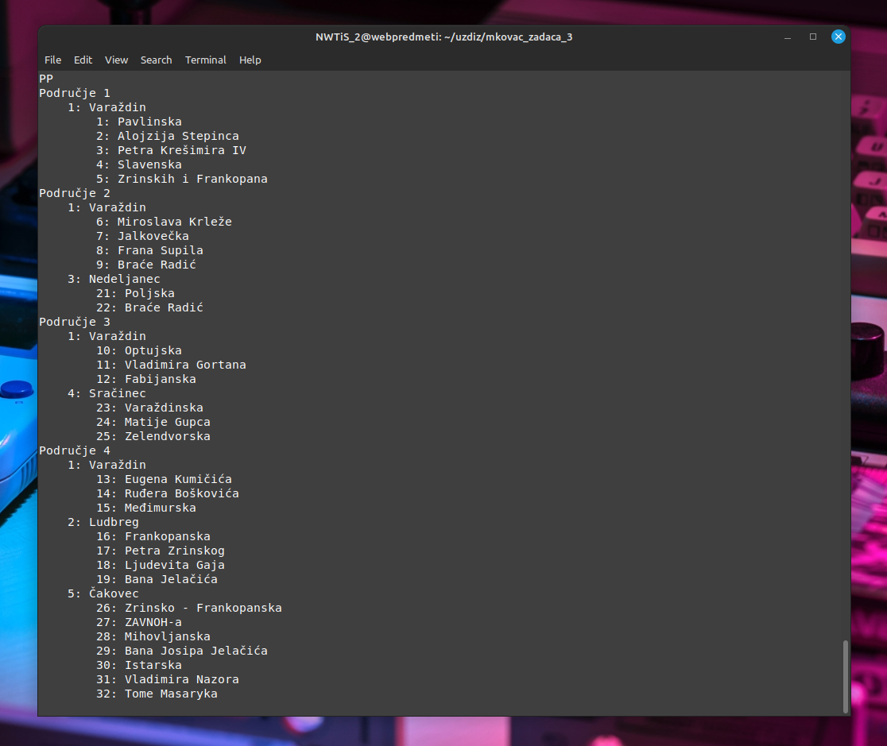
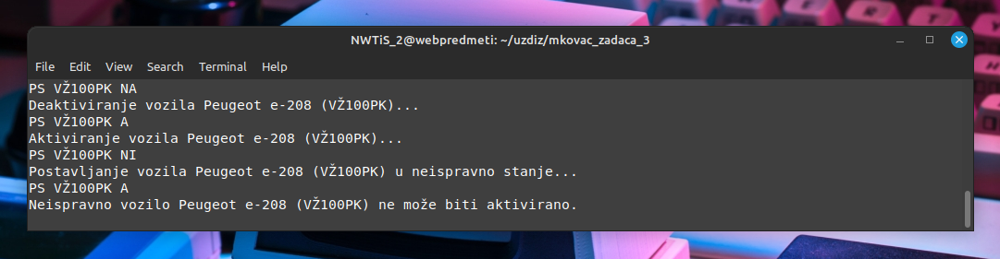
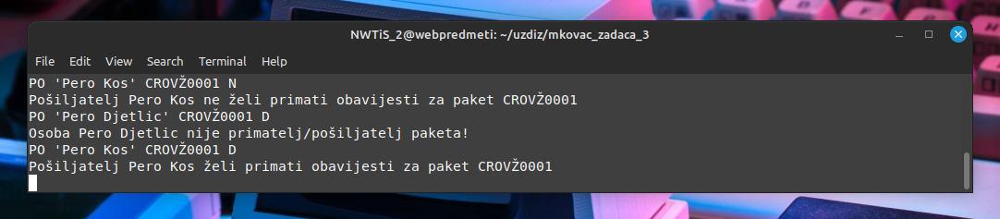

<a name="readme-top"></a>

<div align="right">
<a href="./README.en.md"></a>
</div>

<!-- INTRO -->
<br />
<div align="center">
  
  

  <h3 align="center">Dostava paketa</h3>

  <p align="center">
    Zadaće na temu dostave paketa iz kolegija Uzorci dizajna
    <br /> 
    <a href="https://nastava.foi.hr/course/93149"><strong>Saznajte više »</strong></a>
    <br />

  </p>

  <br>
  
  <!-- TABLE OF CONTENTS -->

  <a href="#-uvod">Uvod</a> • 
  <a href="#-zadatak">Zadatak</a> • 
  <a href="#-struktura-rješenja">Struktura rješenja</a> • 
  <a href="#-konfiguracija">Konfiguracija</a> • 
  <a href="#-upotreba">Upotreba</a> • 
  <a href="#-korišteni-alati">Korišteni alati</a>
</div>

<br>

<div align="center">
  
</div>

<!-- ABOUT THE PROJECT -->
## 📖 Uvod

### Općenito

<table>
  <tbody>
    <tr>
      <td>👦🏽 Autor</td>
      <td>Marijan Kovač</td>
    </tr>
    <tr>
      <td>🧑🏽‍🏫 Nastavnik</td>
      <td>Prof dr. sc. Dragutin Kermek</td>
    </tr>
    <tr>
      <td>📚 Kolegij</td>
      <td>Uzorci dizajna</td>
    </tr>
    <tr>
      <td>🏛️ Ustanova</td>
      <td>Sveučilište u Zagrebu <br> Fakultet organizacije i informatike <br> Varaždin</td>
    </tr>
    <tr>
      <td>📆 Godina <br>polaganja</td>
      <td>2024</td>
    </tr>
  </tbody>
</table>

### Struktura

Repozitorij se sastoji od ukupno tri zadaće koje je bilo potrebno izraditi na kolegiju:

  * <a href="./mkovac_zadaca_1/">Zadaća 1</a>
  * <a href="./mkovac_zadaca_2/">Zadaća 2</a>
  * <a href="./mkovac_zadaca_3/">Zadaća 3</a>

S obzirom da su se zadaće nadovezivale jedna na drugu, najreprezantetivnija zadaća je upravo ona posljednja - <a href="./mkovac_zadaca_3/">Zadaća 3</a>, koja će ujedno biti i opisana u nastavku.

<p align="right">(<a href="#readme-top">povratak na vrh</a>)</p>

## 📝 Zadatak

### Opis

Tvrtka obavlja dostavu različitih vrsta paketa uz određene usluge dostave. Paket može
biti tipski koji ima predefinirane dimenzije (to su tipski paketi s oznakama A, B, C, D, E) i slobodnim
dimenzijama (oznaka X, postoji maksimalna visina, širina i dužina). Za svaki tipski paket postoji
maksimalna težina, a kod paketa X slobodnih dimenzija maksimalna težina određena je
parametrom (mt) prilikom izvršavanja programa. Usluge dostave mogu biti standardna (S), hitna
(H), plaćanje pouzećem (P), povratak paketa (R). <br><br>
Tvrtka ima radno vrijeme koje je određeno parametrima (pr za početak rada i kr za kraj
rad) prilikom izvršavanja programa. Tvrtka se sastoji od ureda za prijem paketa od strane
pošiljatelja i ureda za dostavu paketa na adresu primatelja. Ured za prijem paketa evidentira za
svaki paket vrijeme prijema paketa, pošiljatelja, primatelja, vrstu paketa (kod X i ostale podatke),
vrstu usluge (iznos kod plaćanja pouzećem). Podaci za pakete na prijemu se kronološki
evidentiraju. Za svaki primljeni paket potrebno je naplatiti iznos dostave (svaki tipski paket ima
svoju cijenu dostave, a za paket X slobodnih dimenzija formula se nalazi u tablici 1), osim kod
paketa s uslugom plaćanja pouzećem. Njega naplaćuje vozilo koje odrađuje isporuku. Kod
prijema paketa sustav obavještava pošiljatelja i primatelja paketa da je paket zaprimljen.
Obavještavanje o promjeni statusa paketa mora se temeljiti na uzorku dizajna Observer. Svi
pošiljatelji i primatelji paketa na početku imaju pridruženo obavještavanje za svaki paket. Može
se komandom promijeniti. <br><br>
Ured za dostavu paketa raspolaže s određenim voznim parkom (od bicikla, skutera do
automobila). Svako vozilo ima kapacitet prijevoza (težina u kg, prostor u m3). Prostor koji pokriva
ured podijeljen je u više područja. Jedno područje može pokrivati jedno mjesto/grad ili više njih.
Jeno mjesto ima jednu ili više ulica. Jedno područje može sadržavati jedno ili više mjesta pri čemu
u područje ulaze sve ulice pojedinog mjesta/grada ili samo dio njih. Npr. može biti situacija da
jedno područje pokriva jedno mjesto i samo neke njegove ulice. Ili jedno područje pokriva dva
mjesta sa svim njihovim ulicama i dio ulica trećeg mjesta. Struktura područja mora se temeljiti na
uzorku dizajna Composite. <br><br>
Za svako vozilo određena su područja koja pokriva i to prema njihovom rangu. Vozila
mogu biti aktivna, neispravna ili neaktivna. Samo aktivna vozila mogu sudjelovati u ukrcavanju
paketa. Vozilo koje je ili je postalo neispravno ne može se koristiti do kraja rada programa ali
sudjeluje u ispisima koji se odnose na vozila. Vozilo koje je postalo neaktivno ne može obavljati svoju funkciju dok mu se ne promijeni status u aktivno. Rad s vozilima mora se temeljiti na uzorku
dizajna State. Rad jednog vozila temelji se na ukrcavanju paketa, isporuci paketa i povratku u
ured. To čini jednu vožnju. Vozilo može obaviti više vožnji tijekom radnog dana. Ukrcavanje
paketa može se obaviti samo unutar radnog vremena. Isporuka paketa može se obaviti i nakon
radnog vremena tako dugo dok se ne isporuče svi paketi. <br><br>
Pakete koje treba dostaviti ukrcavaju se u slobodno vozilo tako da se ne prekorači njegova
dozvoljena težina i prostor. Na kraju svakog punog sata odlučuje se koji paketi se mogu ukrcati u
pojedino vozilo temeljem adrese paketa (a time i područja kojem pripada) i područja koje je
pridruženo vozilu. Adresa paketa dobije se na temelju primatelja paketa, njegovog grada, ulice i
kućnog broja. Vozilo u jednoj vožnji može prevoziti pakete samo iz jednog područja (određuje se
na temelju prvog paketa koji se ukrca). Prvo se ukrcavaju paketi koji imaju hitnu dostavu. Ako
postoje paketi s hitnom dostavom za svakog od njih traži se vozilo koje je već pridruženo za
područje tog paketa s hitnom dostavom (prethodni paket s hitnom dostavom) ili ispravno slobodno
vozilo koje je najviše rangirano za područje paketa s hitnom dostavom, uz uvjet da ima
raspoloživu težinu i prostor za paket. Ako se pronađe raspoloživo vozilo tada će ono u toj vožnji
obavljati dostavu za to područje. Ako za pojedini sat trenutno ne postoji raspoloživo vozilo za
prijevoz paketa s hitnom dostavom taj će paket pričekati do sljedećeg punog sata. Nakon što su
svi mogući paketi s hitnom dostavom pridruženi raspoloživim vozilima slijedi ukrcavanje ostalih
paketa. Za ostale pakete vrijedi slična pravila kao i za pakete s hitnom dostavom. Prvo se traži
vozilo koje je već pridruženo za područje tog paketa ili ispravno slobodno vozilo koje je najviše
rangirano za područje paketa, uz uvjet da ima raspoloživu težinu i prostor za paket. Ako za
pojedini sat trenutno ne postoji raspoloživo vozilo za prijevoz paketa taj će paket pričekati do
sljedećeg punog sata. Kod ukrcavanja paketa u vozilo sustav obavještava pošiljatelja i primatelja
paketa da je paket ukrcan u vozilo. Sada vozila kreću prema odredištima paketa.<br><br>
Paketi se mogu isporučivati na dva načina (parametar isporuka):
1. Prema redoslijedu kako su ukrcani u vozilo. Za sve pakete u vozilu izračunava se
udaljenosti između trenutne GPS koordinate (u prvom segmentu to je GPS ureda,
parametar gps) i GPS koordinate za adresu paketa. GPS adresa paketa
izračunava se interpolacijom GPS koordinata početka ulice (gps_lat_1 i
gps_lon_1) i GPS koordinata kraja ulice (gps_lat_2 i gps_lon_2) te kućnog broj
adrese paketa i najvećeg kućnog broja u ulici. Nakon prvog paketa njegova GPS
lokacija postaje trenutna lokacija te se izračunava udaljenosti za sljedeći paket. I
tako se nastavlja dok se ne obavi za zadnji paket za dostavu.

2. Određivanjem paketa s najbližom dostavom. Za svako vozilo potrebno je odrediti
redoslijed isporuka njegovih paketa. Prvo se određuje koji paket ima najbližu
dostavu od ureda. Za sve pakete u vozilu izračunava se udaljenosti između trenutne GPS koordinate (u prvom segmentu to je GPS ureda, parametar gps) i
GPS koordinate za adrese paketa. Kada se odredi paket s najbližom dostavom
onda njegova GPS lokacija postaje trenutna lokacija te se traži sljedeći paket s
najbližom dostavom. I tako se nastavlja dok se ne utvrdi zadnji paket za dostavu.

<br>

Za svaki paket ukupno vrijeme za isporuku sastoji se od vremena vožnje do adrese i vremena
postupka isporuke. Vrijeme vožnje izračunava se na temelju potrebnog vremena da se prođe
udaljenost od trenutne pozicije do pozicije odredišta paketa uz prosječnu brzinu vozila. Vrijeme
postupka isporuke određeno je parametrom (vi u minutama) prilikom izvršavanja programa. Kod
isporuke paketa primatelju potrebno je evidentirati vrijeme preuzimanja paketa. Ako je paket s
uslugom plaćanja pouzećem potrebno je kod vozila ažurirati prikupljeni novac s iznosom pouzeća.
Nakon preuzimanja paketa sustav obavještava pošiljatelja i primatelja paketa da je paket preuzet.
Kada se isporuči zadnji paket iz jednog vozila potrebno je vozilo vratiti u ured za što se izračunava
vrijeme koje je potrebno da vozilo prođe udaljenost od trenutne pozicije do pozicije ureda uz
prosječnu brzinu vozila.

### Datoteke

<table>
  <thead>
    <tr>
      <th>Datoteka</th>
      <th>Primjer</th>
      <th>Dodatne informacije</th>
    </tr>
  </thead>
  <tbody>
    <tr>
      <td>Podaci vrsta paketa</td>
      <td>DZ_3_vrste.csv</td>
      <td>Oznaka, opis, visina, širina, dužina,
      maksimalna težina, cijena, cijena hitno,
      cijenaP, cijenaT. CijenaP i cijenaT ne
      koriste se kod tipskih paketa (imaju 0,0).
      Visina, širina, dužina su u m. Maksimalna
      težina je u kg.
      Kod vrste X visina, širina i dužina
      predstavljaju maksimalne vrijednosti, a
      maksimalna težina je 0,0 jer se drugačije
      određuje. Kod vrste X cijena se izračunava
      na bazi osnovne cijene te joj se pribrajaju: <br>
      1. umnožak cijenaP i volumena prostora u
      m3 <br>
      2. umnožak cijenaT i težine u kg.</td>
    </tr>
    <tr>
      <td>Popis vozila</td>
      <td>DZ_3_vozila.csv</td>
      <td>Registracija, opis, kapacitet težine u kg,
      kapacitet prostora u m3, redoslijed,
      prosječna brzina, područja po rangu, status</td>
    </tr>
    <tr>
      <td>Popis prijema
      paketa</td>
      <td>DZ_3_paketi.csv</td>
      <td>Oznaka, vrijeme prijema, pošiljatelj,
      primatelj, vrsta paketa (ako je tipski onda
      se za sljedeća 3 podatka ne unose
      vrijednosti tj. imaju 0,0), visina, širina,
      dužina, težina, usluga dostave, iznos
      pouzeća (ako je ta usluga, inače 0).
      Visina, širina, dužina su u m. Težina je u
      kg.
      Paketi se upisuju prema vremenu prijema
      (kronološki).</td>
    </tr>
    <tr>
      <td>Popis ulica</td>
      <td>DZ_3_ulice.csv</td>
      <td>Id, naziv, gps_lat_1, gps_lon_1 (GPS
      koordinate početka ulice), gps_lat_2,
      gps_lon_2 (GPS koordinate kraja ulice),
      najveći kućni broj</td>
    </tr>
    <tr>
      <td>Popis mjesta</td>
      <td>DZ_3_mjesta.csv</td>
      <td>Id, naziv, ulica, ulica, ulica, ...</td>
    </tr>
    <tr>
      <td>Popis osoba</td>
      <td>DZ_3_osobe.csv</td>
      <td>Osoba, grad, ulica, kbr
      Rade se o primateljima paketa, a oni mogu
      biti osobe i tvrtke. Mogu biti uključeni i
      pošiljatelji paketa, odnosno neki mogu biti i
      pošiljatelji i primatelji paketa.</td>
    </tr>
    <tr>
      <td>Popis područja</td>
      <td>DZ_3_podrucja.csv</td>
      <td>Id, grad:ulica, grad:ulica, grad:* (sve ulice
      grada), ...</td>
    </tr>
  </tbody>
</table>

### Parametri

Datoteka parametara sadrži parametre u obliku para ključ=vrijednost:
```bash
vp=DZ_3_vrste.csv #datoteka vrsta paketa
pv=DZ_3_vozila.csv #datoteka vozila
pp=DZ_3_paketi.csv #datoteka paketa
po=DZ_3_osobe.csv #datoteka osoba
pm=DZ_3_mjesta.csv #datoteka mjesta
pu=DZ_3_ulice.csv #datoteka ulica
pmu=DZ_3_podrucja.csv #datoteka podrucja
mt=100 #maksimalna težina
vi=5 #vrijeme isporuke
vs=21.11.2023. 06:00:00 #virtualni sat
ms=600 #množitelj sekunde
pr=07:00 #početak rada
kr=19:00 #kraj rada
gps= 46.305433, 16.336646 #gps koordinate ureda
isporuka=2 #strategija isporuke (1 ili 2)
```

<br><br>

Detaljnije upute možete pročitati <a href="./mkovac_zadaca_3/UzDiz_opis_zadace_2023_2024_Z3.pdf"><strong>ovdje</strong></a>.

<p align="right">(<a href="#readme-top">povratak na vrh</a>)</p>

## 🧩 Struktura rješenja

Na slici možete vidjeti dijagram klasa s naglašenim uzorcima dizajna koji su korišteni. Za detaljnije informacije o rješenju kliknite <a href="./mkovac_zadaca_3/mkovac_zadaca_3.pdf"><strong>ovdje</strong></a>.

<div align="center">
  <a href="./dokumentacija/dz3_dijagram_v2.png"></a>
</div>

<p align="right">(<a href="#readme-top">povratak na vrh</a>)</p>

## ⚙️ Konfiguracija

### Preduvjeti

Za pokretanje rješenja bit će vam potrebno slijedeće:

* Operativni sustav Linux (preporuka)
  
  Za izradu rješenja korišten je <a href="https://linuxmint.com/">Linux Mint</a> na <a href="https://www.virtualbox.org/">Oracle VirtualBox VM</a>. 

* Java 17 ili veća:
  * smjestite se u željeni direktorij za preuzimanja, npr:
  ```bash
  cd /opt/alati/
  ```

  * preuzmite Java OpenJDK 17.0.2:
  ```bash
  curl https://download.java.net/java/GA/jdk17.0.2/dfd4a8d0985749f896bed50d7138ee7f/8/GPL/openjdk-17.0.2_linux-x64_bin.tar.gz -O
  ```

  * smjestite se u slijedeći direktorij (preporuka):
  ```bash
  cd /usr/lib/jvm
  ```

  * izdvojite arhivu:
  ```bash
  sudo tar -xvf /opt/alati/openjdk-17.0.2_linux-x64_bin.tar.gz -C .
  ```

  * podesite varijablu okruženja:

  Otvorite datoteku `/etc/profile.d/jdk.sh`

  i promijenite/dodajte slijedeću liniju:

  ```bash
  export JAVA_HOME=/usr/lib/jvm/jdk-17.0.2
  ```

  * restartirajte sustav (preporuka)

  * provjerite ispravnost instalacije:

  ```bash
  java -version
  ```

  Ako je sve bilo u redu, trebali biste dobiti rezultat sličan ovome:

  ```bash
  openjdk version "17.0.2" 2022-01-18
  OpenJDK Runtime Environment (build 17.0.2+8-86)
  OpenJDK 64-Bit Server VM (build 17.0.2+8-86, mixed mode, sharing)
  ```


* Maven:
  * ažurirajte repozitorij:
  ```bash
  sudo apt update
  ```
  * instalirajte Maven:
  ```bash
  sudo apt install maven
  ```
  * provjerite ispravnost instalacije:
  ```bash
  mvn -version
  ```
  Ako je sve bilo u redu, trebali biste dobiti rezultat sličan ovome:
  ```bash
  Apache Maven 3.6.3
  Maven home: /usr/share/maven
  Java version: 17.0.2, vendor: Oracle Corporation, runtime: /usr/lib/jvm/jdk-17.0.2
  Default locale: en_US, platform encoding: UTF-8
  OS name: "linux", version: "5.15.0-69-generic", arch: "amd64", family: "unix"
  ```

* Eclipse IDE (opcionalno)

  Preuzmite i instalirajte <a href="https://www.eclipse.org/ide/">Eclipse IDE</a>. Konfigurirajte Eclipse IDE za Java 17 prema potrebi.

<br>

⚠️ Ako koristite drugu Linux distribuciju (npr. Fedora ili Arch), a pogotovo Windows OS, programsko rješenje se možda neće ispravno pokretati.

### Pokretanje

  * Klonirajte ovaj repozitorij:

  ```bash
  https://github.com/mkovac700/uzdiz.git
  ```

  * smjestite se u direktorij `mkovac_zadaca_3`

  * izvršite kompiliranje (potrebno samo prvi put):

  ```bash
  mvn clean package
  ```

  * izvršite program na slijedeći način (primjer):

  ```bash
  java -jar /home/NWTiS_2/uzdiz/mkovac_zadaca_3/target/mkovac_zadaca_3-1.0.0.jar DZ_3_parametri.txt
  ```

<p align="right">(<a href="#readme-top">povratak na vrh</a>)</p>

## 🚀 Upotreba

Korisniku se daje mogućnost izvršavanja sljedećih komandi:

* <strong>Izvršavanje programa određeni broj sati virtualnog vremena</strong>
  * sintaksa
    ```bash
    VR hh
    ```
  * primjer
    ```bash
    VR 4
    ```
  * opis

    Virtualni sat programa radi prema korigiranom broju sekundi. Npr. ako je `--ms 600` znači da se u jednoj sekundi stvarnog vremena izvrši 600 sekundi
    virtualnog sata. To znači da se odradi jedna sekunda spavanja u stvarnom
    vremenu, korigirati virtualni sat, ispisati vrijeme virtualnog sata na ekran,
    provjeriti da li je stigao novi paket ili više njih u uredu za prijem. Primljeni
    paketi se ukrcavaju u vozilo (na kraju svakog punog sata prema gornjem
    opisu ukrcavanja paketa). Na ekran se ispisuje svaki paket koji je ukrcan u
    vozilo (i virtualno vrijeme). Kada dođe vrijeme za određeno vozilo ono
    može krenuti s dostavom kod primatelja. Na ekran se ispisuje kada vozilo
    krene na dostavu paketa. Na ekran se ispisuje svaki paket koji je isporučen
    primatelju (i virtualno vrijeme). Tako se izvršava virtualno vrijeme dok ne
    istekne zadano vrijeme izvršavanja ili dođe do kraja radnog vremena. Na
    ekran se ispisuje zašto je došlo do kraja rada. Može se više puta izvršiti
    komanda.

  <div align="center">
    
  </div>

* <strong>Pregled statusa paketa u trenutku virtualnog vremena</strong>
  * sintaksa
    ```bash
    IP
    ```
  * primjer
    ```bash
    IP
    ```
  * opis

    Ispis tablice s primljenim i dostavljenim paketima (vrijeme prijema, vrsta
    paketa, vrsta usluge, status isporuke, vrijeme preuzimanja, iznos dostave,
    iznos pouzeća) u trenutno vrijeme virtualnog sata. Ispis primljenog paketa
    provjerava da li je vrijeme prijema manje od virtualnog vremena. Paket je
    dostavljen ako je vrijeme preuzimanja manje od virtualnog vremena.

  <div align="center">
    
  </div>

* <strong>Pregled podataka za vozila u trenutku virtualnog vremena</strong>
  * sintaksa
    ```bash
    SV
    ```
  * primjer
    ```bash
    SV
    ```
  * opis

    Ispis tablice s podacima o svim vozilima (status, ukupno odvoženi km, broj
    paketa u vozilu (hitnih, običnih, isporučenih), trenutni % zauzeća (prostora
    i težine), broj vožnji. Ispis podataka mora se temeljiti na uzorku dizajna
    Visitor.

  <div align="center">
    
  </div>

* <strong>Pregled podataka za vožnje vozila tijekom dana</strong>
  * sintaksa
    ```bash
    VV vozilo
    ```
  * primjer
    ```bash
    VV VŽ100PK
    ```
  * opis

    Ispis tablice s podacima o pojedinim vožnjama odabranog vozila (vrijeme
    početka, vrijeme povratka, trajanje, ukupno odvoženo km, broj paketa u
    vozilu (hitnih, običnih, isporučenih), % zauzeća (prostora i težine) na
    početku vožnje). Ispis podataka mora se temeljiti na uzorku dizajna Visitor.

  <div align="center">
    
  </div>

* <strong>Pregled podataka za segmente vožnje vozila tijekom dana</strong>
  * sintaksa
    ```bash
    VS vozilo n
    ```
  * primjer
    ```bash
    VS VŽ100PK 1
    ```
  * opis

    Ispis tablice s podacima o segmentima 1. vožnje odabranog vozila (vrijeme
    početka, vrijeme kraja, trajanje, odvoženo km, paket (ako nije povratak u
    ured)). Ispis podataka mora se temeljiti na uzorku dizajna Visitor.

  <div align="center">
    
  </div>

* <strong>Pregled područja s hijerarhijskim prikazom mjesta koja uključuje, a mjesta koje ulice.
Svaka nova razina ima uvlaku od 4 praznine.</strong>
  * sintaksa
    ```bash
    PP
    ```
  * primjer
    ```bash
    PP
    ```
  * opis

    Ispis tablice s podacima o područjima, njihovim mjestima i ulicama mjesta
    koje ulaze u područje.

  <div align="center">
    
  </div>

* <strong>Promjena statusa vozila u trenutku virtualnog vremena</strong>
  * sintaksa
    ```bash
    PS vozilo [A | NI | NA]
    ```
    A – aktivno
    ● NI – nije ispravno
    ● NA nije aktivno
  * primjer
    ```bash
    PS VŽ100PK NI
    ```
  * opis

    Vozilu VŽ100PK se postavlja status da nije ispravno.

  <div align="center">
    
  </div>

* <strong>Promjena statusa slanja obavijest za pošiljatelja ili primatelja paketa</strong>
  * sintaksa
    ```bash
    PO 'primatelja/pošiljatelja' paket [D | N]
    ```
    D – šalju se obavijesti
    ● N – ne šalju se obavijesti
  * primjer
    ```bash
    PO 'Pero Kos' CROVŽ0001 N
    ```
  * opis

    Pošiljatelj Pero Kos ne želi primati obavijesti za paket CROVŽ0001.

  <div align="center">
    
  </div>

* <strong>Prekid rada programa</strong>
  * sintaksa
    ```bash
    Q
    ```

<p align="right">(<a href="#readme-top">povratak na vrh</a>)</p>

## ⛏️ Korišteni alati

<div align="center">
  
  <a href="https://www.java.com/en/"></a>
  <a href="https://www.eclipse.org/"></a>
  <a href="https://maven.apache.org/"></a>
</div>

<p align="right">(<a href="#readme-top">povratak na vrh</a>)</p>


